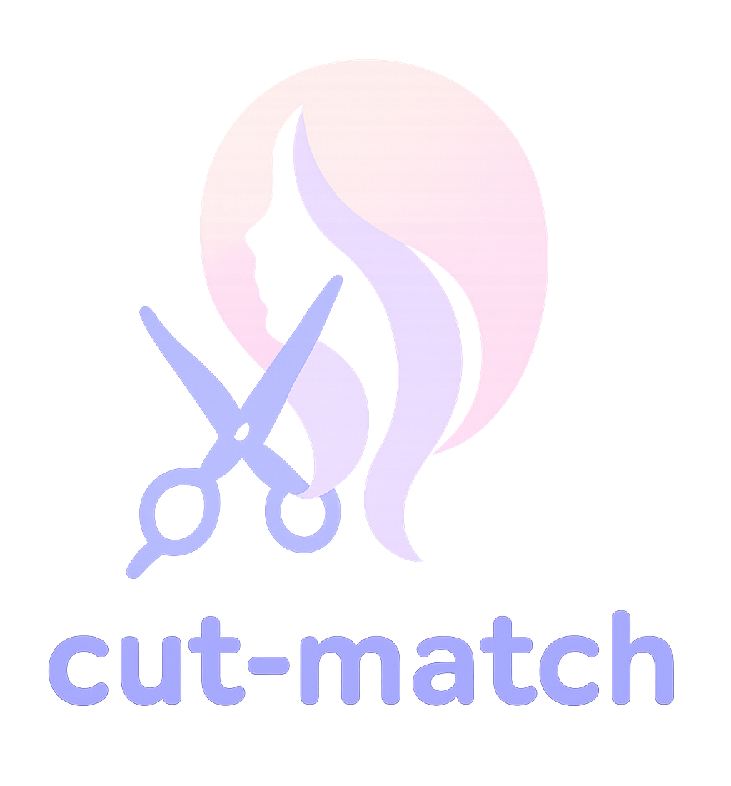

<div align="center">
  
  <h1>Cut Match API ✂️</h1>
  <p>
    <strong>Backend API สำหรับแอปพลิเคชันค้นหา, ลอง, และแบ่งปันสไตล์ทรงผม</strong>
  </p>
  <p>
    <a href="https://cut-match-api.vercel.app/api-docs">
      
    </a>
    
    
    
  </p>
</div>

---

## 📡 **BASE URL API:** **[https://cut-match-api.vercel.app/api](https://cut-match-api.vercel.app)**

---

## 📖 เกี่ยวกับโปรเจค (About The Project)

**Cut Match API** คือระบบ Backend ที่ถูกสร้างขึ้นเพื่อเป็นหัวใจสำคัญของแอปพลิเคชัน "Cut Match" ซึ่งเป็นแพลตฟอร์มสำหรับผู้ที่รักในแฟชั่นทรงผม โปรเจคนี้เป็นมากกว่าแค่แกลเลอรีทรงผม แต่เป็น **ชุมชน (Community)** ที่ผู้ใช้สามารถค้นหาแรงบันดาลใจ, ลองทรงผมเสมือนจริง, แบ่งปันสไตล์ของตัวเอง, และเชื่อมต่อกับผู้ใช้คนอื่นๆ ได้อย่างครบวงจร

โปรเจคนี้ถูกสร้างขึ้นด้วยสถาปัตยกรรมที่ทันสมัย, ปลอดภัย, และพร้อมสำหรับการขยายในอนาคต

---

## 🏗️ โครงสร้างโปรเจกต์ (Project Structure)

โปรเจคนี้ใช้สถาปัตยกรรมแบบ Model-View-Controller (MVC) เพื่อแบ่งแยกหน้าที่การทำงานอย่างชัดเจน ทำให้ง่ายต่อการบำรุงรักษาและพัฒนาต่อ

```
/
├── config/             # ไฟล์ตั้งค่าการเชื่อมต่อ (เช่น Cloudinary)
├── controllers/        # ส่วนจัดการ Logic หลักของแต่ละฟีเจอร์
├── middleware/         # ส่วนจัดการคำขอกลางทาง (เช่น ยืนยันตัวตน, จัดการ Error)
├── models/             # พิมพ์เขียวของข้อมูลใน Database (Schemas)
├── public/             # โฟลเดอร์สำหรับไฟล์สาธารณะ (เช่น favicon)
├── routes/             # ส่วนกำหนดเส้นทาง (Endpoints) ของ API
├── .env                # ไฟล์เก็บค่าตัวแปรสำคัญ (ต้องสร้างเอง)
└── index.js            # ไฟล์เริ่มต้นของเซิร์ฟเวอร์
```

---

## ✨ ฟีเจอร์หลัก (Features)

- **🧍 ระบบผู้ใช้และการยืนยันตัวตน**
  - สมัคร, ล็อกอิน, จัดการโปรไฟล์ (CRUD), อัปโหลดรูป, เพิ่มข้อมูลร้าน
- ** social ระบบโซเชียล**
  - ติดตาม/เลิกติดตาม, สร้าง Timeline Feed, สร้างโพสต์ (หลายรูป), ไลค์, คอมเมนต์ (Nested), แก้ไข/ลบ
- **💇 ระบบจัดการเนื้อหา**
  - Admin CRUD ทรงผมและร้านตัดผม, ค้นหา/กรองข้อมูล, ค้นหาร้านใกล้เคียง
- **📸 ฟีเจอร์สำหรับแอป**
  - รองรับ Virtual Try-On, จัดการ Favorites & Saved Looks, ระบบรีวิว, ระบบแจ้งเตือน

---

## 🛠️ เทคโนโลยีที่ใช้ (Tech Stack)

| Category | Technology |
| :--- | :--- |
| **Backend** | Node.js, Express.js |
| **Database** | MongoDB, Mongoose |
| **Cloud Services** | Cloudinary (Image Storage), Render/Vercel (Deployment) |
| **Authentication** | JSON Web Token (JWT), bcrypt.js |
| **API Docs** | Swagger UI Express, swagger-jsdoc |
| **Security** | Helmet, express-rate-limit |
| **Validation** | express-validator |

---

## 🗺️ ภาพรวม Endpoints (API Endpoints Overview)

นี่คือภาพรวมของเส้นทาง API หลักๆ ที่มีในโปรเจค

- **Auth & Users (`/api/users`)**
  - `POST /register`: สมัครสมาชิก
  - `POST /login`: เข้าสู่ระบบ
  - `GET, PUT, DELETE /profile`: จัดการโปรไฟล์ของตัวเอง
  - `GET /public/:id`: ดูโปรไฟล์สาธารณะของคนอื่น
  - `GET /search`: ค้นหาผู้ใช้
  - `POST, DELETE /{id}/follow`: ติดตาม/เลิกติดตามผู้ใช้

- **Hairstyles & Reviews (`/api/hairstyles`)**
  - `GET /`: ดูทรงผมทั้งหมด (รองรับการกรองด้วย `?search=`, `?gender=`, `?tags=`)
  - `POST, PUT, DELETE /{id}`: จัดการทรงผม (Admin only)
  - `GET, POST /{id}/reviews`: ดูและสร้างรีวิวสำหรับทรงผม

- **Posts, Comments, Likes (`/api/posts`, `/api/comments`)**
  - `POST /posts`: สร้างโพสต์ใหม่
  - `GET /posts/feed`: ดึงข้อมูล Timeline Feed
  - `PUT, DELETE /posts/:id`: แก้ไข/ลบโพสต์
  - `POST /posts/:id/like`: กดไลค์/ยกเลิกไลค์โพสต์
  - `POST /posts/:postId/comments`: สร้างคอมเมนต์
  - `POST /comments/:id/reply`: ตอบกลับคอมเมนต์

- **Salons (`/api/salons`)**
  - `GET /nearby`: ค้นหาร้านตัดผมใกล้เคียง
  - `POST, PUT, DELETE /`: จัดการข้อมูลร้าน (Admin only)

- **Notifications (`/api/notifications`)**
  - `GET /`: ดึงการแจ้งเตือนทั้งหมด
  - `POST /mark-read`: อัปเดตสถานะว่าอ่านแล้ว

> สำหรับรายละเอียดทั้งหมดของแต่ละ Endpoint รวมถึง Request Body และ Response Schemas กรุณาดูที่ **[Swagger API Docs](https://cut-match-api.onrender.com/api-docs)**

---

## 🚀 การติดตั้งและรันโปรเจค (Getting Started)
ทำตามขั้นตอนต่อไปนี้เพื่อรันโปรเจคบนเครื่องของคุณ

### สิ่งที่ต้องมี
- Node.js (v18.x หรือสูงกว่า)
- npm
- MongoDB Connection String
- Cloudinary Credentials

### ขั้นตอนการติดตั้ง
1.  **Clone a repository:**
    ```bash
    git clone [https://github.com/your-username/cut-match-api.git](https://github.com/your-username/cut-match-api.git)
    cd cut-match-api
    ```

2.  **ติดตั้ง Dependencies:**
    ```bash
    npm install
    ```

3.  **สร้างไฟล์ `.env`** และใส่ข้อมูลตามนี้:
    ```env
    PORT=5000
    MONGODB_URI=your_mongodb_connection_string
    JWT_SECRET=your_jwt_secret
    CLOUDINARY_CLOUD_NAME=your_cloudinary_name
    CLOUDINARY_API_KEY=your_cloudinary_api_key
    CLOUDINARY_API_SECRET=your_cloudinary_api_secret
    ```

4.  **รันเซิร์ฟเวอร์ (Development Mode):**
    ```bash
    npm run dev
    ```
---

## 🤝 การมีส่วนร่วม (Contributing)

ยินดีต้อนรับทุกการมีส่วนร่วม! หากคุณมีไอเดียที่จะทำให้โปรเจคนี้ดีขึ้น กรุณา Fork a repository และสร้าง Pull Request หรือเปิด Issue เพื่อแจ้งบั๊กได้เลย

1.  Fork the Project
2.  Create your Feature Branch (`git checkout -b feature/AmazingFeature`)
3.  Commit your Changes (`git commit -m 'Add some AmazingFeature'`)
4.  Push to the Branch (`git push origin feature/AmazingFeature`)
5.  Open a Pull Request

---

## 📜 สัญญาอนุญาต (License)

โปรเจคนี้อยู่ภายใต้สัญญาอนุญาตแบบ MIT License - ดูรายละเอียดเพิ่มเติมได้ที่ไฟล์ `LICENSE`

**สรุปคือ:** คุณสามารถนำโค้ดนี้ไปศึกษา, ดัดแปลง, และใช้งานต่อได้ตามต้องการครับ